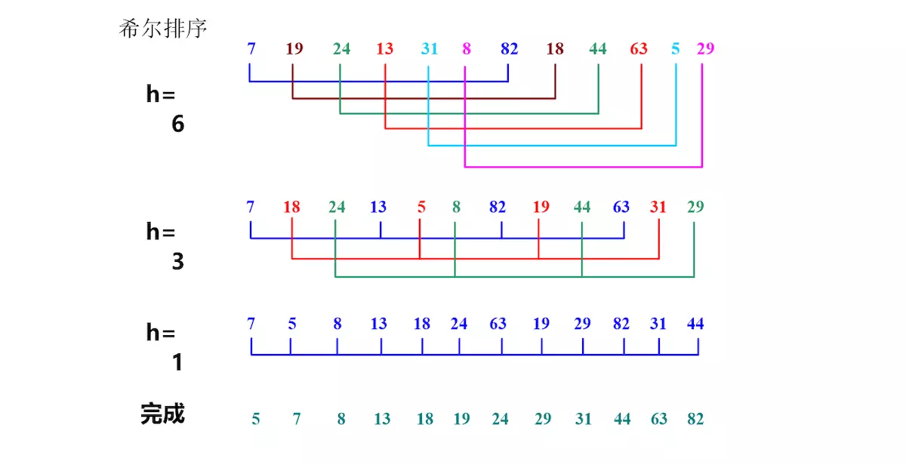

## 直接插入排序算法

* 概述

  直接插入排序算法在逻辑上将整体数据分为两部分，一部分是已排序部分，另一部分是待排序部分 。

  排序的过程是：在待排序部分逐步的拿出一个元素，将其插入到已排序部分中合理的位置 。

* 适用场景

  插入排序在对几乎已经排好序的数据操作时，效率高，即可以达到线性排序的效率，

  但插入排序一般来说是低效的，因为插入排序每次只能将数据移动一位 。

* 数据结构

  直接插入排序使用的数据结构是数组 。

* 优化

  在给当前待排序元素在已排序部分找到一个合适的位置并且待排序数据相对较多的时候，由于已排序部分元素是有序的，因此这个过程可以使用二分法，以优化排序的时间复杂度。

* 归类

  1. in-place（原地算法：基本上不需要额外的空间）。
  2. 稳定排序算法。

* 空间复杂度

  直接插入排序是in-place，因此其空间复杂度是 O(1) 。

* 时间复杂度

  * 最优

    最优的情况是待排序数据为已排序好的期望顺序，此时每次从待排序部分拿出一个元素只需要与待排序部分中最后一个元素相比较一次，需要比较 $n - 1$ 次，因此其复杂度为 $O(n)$ 。

  * 最坏

      最坏的情况是待排序数据为已排序好的，但是其顺序正好与期望顺序相反，此时每次从待排序部分拿出一个元素，该元素需要与其前面的已排序部分中的每一个元素进行比较和交换，其比较或交换的次数为 $0 + 1 + 2 + ... + (n - 2) + (n - 1)$ 也就是　$ \frac{n * (n - 1)}{2}$ ，因此其复杂度为 $O(n^{2})$ 。

  * 平均

    $O(n^{2})$

* 代码示例

  ```c++
  void insertion_sort(int arr[], int len){
          int i,j,key;
          for (i=1;i<len;i++){
                  key = arr[i];
                  j=i-1;
                  while((j>=0) && (arr[j]>key)) {
                          arr[j+1] = arr[j];
                          j--;
                  }
                  arr[j+1] = key;
          }
  }
  ```

  


## 希尔排序算法

- 概述

  希尔排序是插入排序的一个优化版本，是在插入排序的基础上加入了分治的思想，按照设置好的步长进行跳跃式的插入排序，或者说按照步长将数据分为几个部分，分别对这几个部分进行排序。举个例子：有一组数据arr有10个元素，我们设步长为5，排序的开始，定位到首位元素，首位元素是他们组的第一个元素，它们组的第二位元素应该是$arr[0+5]$ 也就是第5个元素。

  

  

- 适用场景

   在shell先生的优化下，希尔排序不仅继承了插入排序的优点，而且可以做到对于数据量稍微大点的，无序的数据也能很快。

- 数据结构

  希尔排序采用的数据结构是数组。

- 归类

  1. in-place（原地算法：基本上不需要额外的空间）。
  2. 不稳定排序算法。

- 空间复杂度

  与插入排序相同，它是一个原地算法，它的时间复杂度是线性的，也就是$O(1)$ 。

- 时间复杂度

  希尔排序的时间复杂度与步长的选取有关，当步长为1的时候，时间复杂度是$O(n^{2})$ 。

  当采用Sedgewick提出的步长（目前最好的步长序列）的时候，时间复杂度为$O({n}log_{2}{n})$ 。

- 代码示例

  ```c
  void shell_sort(int arr[], int len) {
  	int gap, i, j;
  	int temp;
  	for (gap = len >> 1; gap > 0; gap >>= 1)
  		for (i = gap; i < len; i++) {
  			temp = arr[i];
  			for (j = i - gap; j >= 0 && arr[j] > temp; j -= gap)
  				arr[j + gap] = arr[j];
  			arr[j + gap] = temp;
  		}
  }
  ```

  


## 简单选择排序算法

> 　未完待续


---

资源引用声明：

[维基百科]: https://zh.wikipedia.org/wiki/
[算法（一）之排序算法（四）——希尔排序（ShellSort）]: 算法（一）之排序算法（四）——希尔排序（ShellSort）